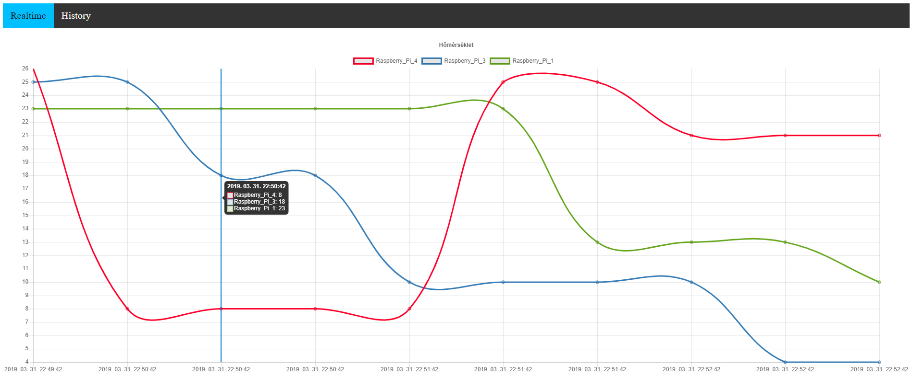
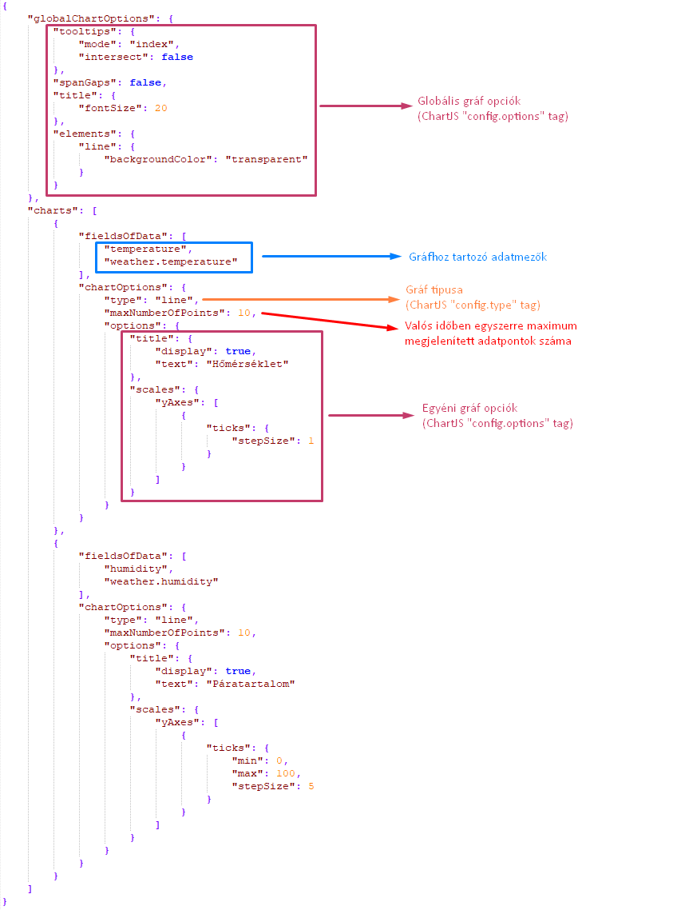

# IoTDataVisualizer
IoT adatok valós idejú és előzmény alapú vizualizálását végző NodeJS alkalmazás.



## Telepítés
Az alkalmazás által használt csomagok telepítését az alábbi parancs kiadásával végezhetjük el:

```console
npm install
```

## Futtatás
Az alkalmazás működéséhez szükséges beállításokat a [config.js](config.js) fájl tartalmazza, 
amelyben az alapértelmezett értékek láthatóak.
Amennyiben más beállításokat szeretnénk használni, megtehetjük azt az adott környezeti változók definiálásával.

A grafikonok tulajdonságai a [visualizer.config.json](visualizer.config.json) fájlban vannak definiálva.
Az abban megadott megjelenítési opciók lehetőségei megegyeznek a [Chart.js](https://www.chartjs.org/docs/latest/) dokumentációjában szereplőekkel.
További információt alábbi kép szolgáltat, amelyen meg vannak jelölve a fájl egyes szekciói, hogy melyik milyen célt szolgál.



A program természeténél fogva egy MQTT brókert és egy [MongoDB](https://www.mongodb.com/) adatbázist igényel, amelyekhez csatlakozni tud.

### Docker image

> ### Figyelem!
> Az alábbi műveletek elvégzése előtt győződjünk meg arról, 
> hogy telepítve van-e a [Docker](https://www.docker.com/products/docker-desktop), 
> különben az alábbi műveletek nem fognak működni!

Lehetőség van az alkalmazás Docker konténerként történő futtatására. 
Ehhez adjuk ki az alábbi parancsokat a projekt gyökérkönyvtárában:

```console
docker build --tag=iot-visualizer .
docker run -p 3000:3000 iot-visualizer
```

> Amennyiben szeretnénk az alapértelmezett beállításokat felülírni környezeti változókkal,
> ajánlott egy **connections.env** fájl létrehozása, ami a környezeti változókat definiálja,
> majd a ```docker run``` parancsot a ```--env-file connections.env``` kapcsolóval futtatni.

> ### Fontos!
> A példában a port, amelyen az alkalmazás elérhető, az alapértelmezett 3000-es értékre volt beállítva.
> Amennyiben szeretnénk változtatni ezen, írjuk át a -p kapcsoló után megadott paraméter kettőspont előtti értékét a kívánt értékre.
> Ha a konténeren belül kiosztott portot is szeretnénk megváltoztatni, 
> akkor a második érték megváltoztatásán túl módosítsuk az új értékre az IOT_VIS_PORT környezeti változó értékét és 
> a [Dockerfile](Dockerfile#L14)-ban a közzétett port értékét. 
